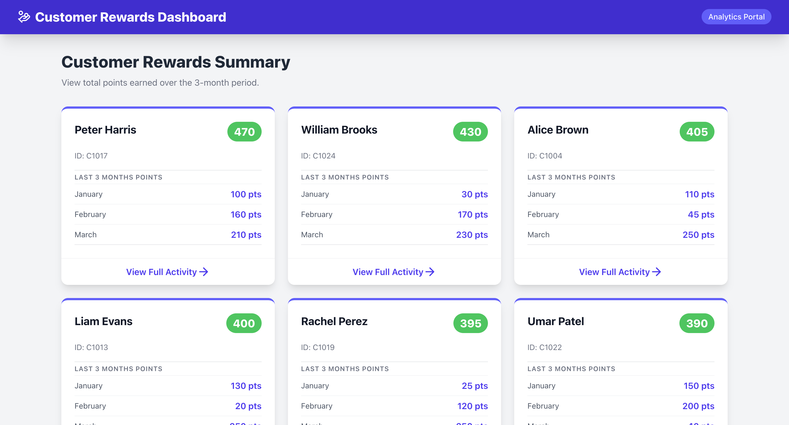
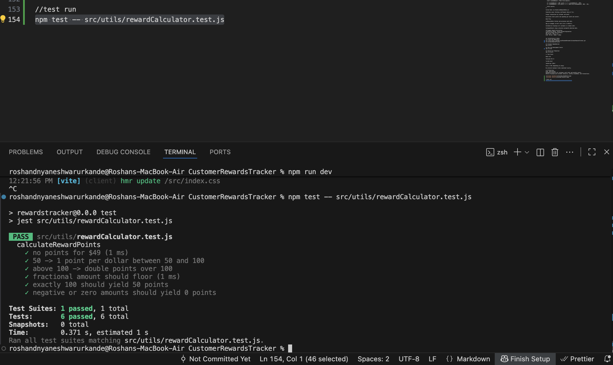

🏆 Customer Rewards Dashboard (React + Tailwind)

A responsive Customer Rewards Analytics Dashboard built with React and Tailwind CSS.
It simulates a 3-month transaction dataset, calculates customer reward points based on spending thresholds, and provides detailed insights by customer and month.

📋 Overview

This application demonstrates:

A real-world points calculation system for customer purchases.

Clean, modular React component architecture.

Custom hooks for data processing (useRewardsData).

Interactive summary and detailed views for each customer.

Modern Tailwind CSS-based UI for responsive design and styling.

⚙️ Features

✅ Reward Points Calculation

Earn 2 points per dollar for spending over $100.

Earn 1 point per dollar for spending between $50–$100.

Amounts are rounded down to the nearest dollar before calculation.

✅ Dynamic Data Simulation

Includes mock transaction data for 3 months (January–March 2025).

Automatically processes transactions per customer and month.

✅ Interactive UI

Customer summary cards showing total and monthly rewards.

Detailed pages showing monthly breakdowns and transaction history.

Back navigation between list and detail views.

✅ Built with Modern React Concepts

Hooks: useState, useEffect, useMemo

Custom hook for data fetching and transformation (useRewardsData)

Modular component structure for clarity and scalability.

🗂️ Project Structure
src/
├── App.jsx                         # Main entry point
│
├── utils/
│   └── rewardCalculator.js         # Reward points calculation logic
│
├── data/
│   └── mockData.js                 # Sample transaction data
│
├── hooks/
│   └── useRewardsData.js           # Custom hook to fetch & process rewards
│
├── components/
│   ├── Header.jsx                  # App header with title
│   ├── CustomerList.jsx            # Displays all customers
│   ├── CustomerCard.jsx            # Summary card for each customer
│   ├── CustomerDetails.jsx         # Detailed customer view
│   │
│   ├── details/
│   │   ├── MonthlyBreakdown.jsx    # Shows monthly points per customer
│   │   └── TransactionTable.jsx    # Displays transactions table
│   │
│   └── shared/
│       └── StatCard.jsx            # Metric display card component
│
└── index.css / main.css            # Tailwind styles (configured separately)

💡 How the Logic Works
Reward Calculation (src/utils/rewardCalculator.js)
const calculateRewardPoints = (amount) => {
  let points = 0;
  const roundedAmount = Math.floor(amount);

  if (roundedAmount > 100) points += 2 * (roundedAmount - 100);
  if (roundedAmount > 50) points += 1 * (Math.min(roundedAmount, 100) - 50);

  return points;
};

Custom Hook (src/hooks/useRewardsData.js)

Simulates async fetching (setTimeout delay of 1s).

Groups transactions by customer and month.

Calculates total points and spending per month and overall.

Data Flow

useRewardsData fetches and processes mock data.

App.jsx manages current view (list or details).

CustomerList displays all customers in ranked order.

CustomerDetails shows selected customer’s detailed data.

🧮 Example Reward Calculation
Transaction Amount	Points Earned	Explanation
$40	0 pts	Below $50 threshold
$75	25 pts	$25 × 1 pt
$120	90 pts	$50×1 + $20×2

🖥️ Installation & Setup
1️⃣ Clone the Repository
git clone https://github.com/RoshanDUrkande/CustomerRewardsApp
cd CustomerRewardsTracker

2️⃣ Install Dependencies
npm install

3️⃣ Run the Development Server
npm run dev

4️⃣ Build for Production
npm run build

🎨 Tech Stack

React 18+

Tailwind CSS 3+

lucide-react

JavaScript (ES6+)

Vite or CRA (depending on setup)

No external backend — data simulated locally.

📸 UI Overview
View	Description
Dashboard	Displays all customers with total and monthly points.
Details	Displays per-customer analytics, monthly breakdown, and transactions.

//test run 
npm test -- src/utils/rewardCalculator.test.js